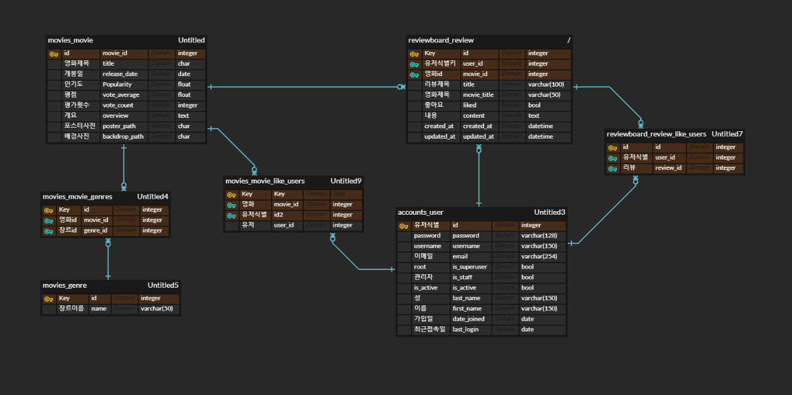

# TEMPLIX

> 오늘의 기분에 어울리는 영화를 찾아 보자! 
>
> 배포서버 👉 http://templix-2022.shop/movies/
>
> 시연 영상 👉 https://www.youtube.com/watch?v=t31Y5x5E8CM

## 👨‍💻 팀원 소개 및 업무 분담

**FrontEnd** [전민재]([]())

**BackEnd** [신선영]([]())

## 🛠 기술 스택 

**FrontEnd**  HTML / CSS / Bootstrap

**BackEnd**  Python / Django

## 😢 목표서비스 구현 실패 목록ㅠㅠ

- 영화 월드컵
- 자동완성
- 위치 서비스 https://apis.map.kakao.com/web/
- 유투브 API
- 영화 필터 정렬

##  🗓 프로젝트 기간 

- 2022.05.19 ~ 2022.05.26(총8일)

## 🎞 프로젝트 구현

### 0. 개요

- **최종 ERD**

  

  - [참고] 초기 ERD

  

- **파일트리 (개요 (일부 생략)**

   

### 1. Movies

- **인덱스 페이지**

   

  - My Movies

    - 사용자가 리뷰를 남긴 영화 목록 출력

    - 비로그인 상태이거나 리뷰 이력이 없을 시 문구 출력

      ```bash
      아직 작성된 리뷰가 없어요!
      영화를 보고 리뷰를 남겨 보세요 :)
      ```

  - Trending Now

    - 전체 영화 중 popularity 기준 상위 12개 영화 출력

  - Top Rated

    - 전체 영화 중 평점 기준 상위 12개 영화 출력

  - 페이지 하단

    - 팀원 github과 싸피 유튜브 링크

- **전체 영화 조회**

   

   - 카드 형태로 전체 영화 목록 제공
  - bootstrap paginator 이용 - 한 페이지에 12개씩 출력
  
- **검색**

  

  - 페이지 상단 검색창에 검색어 입력 시 해당 단어 포함 검색 결과 출력

  

  - 검색어 없이 검색 버튼 입력 시 영화 전체 조회 페이지 출력

- **영화 디테일 페이지**

  

  - 영화 포스터 클릭 시 디테일 페이지 연결
  - 개봉일, 제목, 장르, 별점, 개요 등 정보 조회 가능

- **영화 좋아요 / 댓글**

  

  - 하트 버튼을 누르면 좋아요 입력 가능
  - 댓글 및 평점 입력 / 수정 / 삭제 가능
  - 전체 댓글 위에 모든 사용자의 별점 평균 출력
  - 댓글은 한 번만 작성 가능 - 이미 작성 완료 시 `이미 한줄평을 작성한 영화입니다!` 문구 출력

- **랜덤 이미지 추천 페이지**

  

  - 상단바 [오늘의 장면] 선택 시 랜덤으로 영화의 스틸컷 조회 가능
  - 오른쪽 위 [NEW] 버튼 클릭하면 새로운 이미지 조회 가능
  - 마음에 드는 이미지가 나왔을 때 이미지를 누르면 해당 영화의 디테일 페이지로 이동 가능
  - TMDB API의 `backdrop_path` 속성 사용

- **랜덤 문구 출력 페이지**

  

  - 상단바 [오늘의 대사] 선택 시 랜덤으로 영화 인용구 조회 가능
  - 오른쪽 위 [NEW] 버튼 클릭하면 새로운 문구 조회 가능
  - 마음에 드는 문구 클릭 시 해당 영화 디테일 페이지로 이동
  - TMDB API - get detail의 `tagline` 속성 사용
  - 이슈: 영화의 정보에 태그라인이 존재하지 않는 경우가 많아 조회할 때 까지 시간이 오래걸림 (함수 반복 실행)

### 2. Reviewboard

- **인덱스 페이지**

  

  - 현재까지 작성된 리뷰 조회 가능
  - 카드 위에 제목과 내용 간단 조회 가능

- **리뷰 작성 페이지**

  

  - Movie 탭에서 원하는 영화 선택 후 리뷰 작성
  - 추가 구현 — 영화 제목 검색?
  - 수정 및 삭제 가능

- 리뷰 좋아요

  

### 3. Accounts

- **마이페이지**

  

  - 영화 디테일 페이지에서 좋아요 누른 영화와 커뮤니티 페이지에서 리뷰 남긴 영화 목록 조회
  - 좋아요 누른 영화 기반 좋아하는 장르 목록 출력


  - 작성된 좋아요나 리뷰가 없으면 문구 출력


- **회원가입**

  

- **로그인/로그아웃**

  

  - 로그아웃은 별도의 페이지 없이 로그아웃 키 누르면 가능

- **정보 수정**

  

  - 마이페이지의 회원정보수정 버튼 이용하여 이동 가능

### 4. Admin

- **admin 페이지에서 관리**

  

  - 장르, 영화, 작성된 리뷰 데이터 생성 / 수정 및 삭제 가능

- **개별 페이지에서 관리 (영화 / 리뷰)**

  

  - admin 계정으로 로그인 시 모든 디테일 페이지에서 댓글 수정 / 삭제 가능

  

  - admin 계정으로 로그인 시 리뷰 수정 / 삭제 가능


## 🙂 느낀점

- 신선영

  처음부터 끝까지 하나의 페이지를 완성한다는 것이 처음에는 너무 막막했지만, 하나하나 구성하는 재미를 느낄 수 있었습니다.

  머리속에서만 그리던 과정을 백엔드로 구현해서 실제로 데이터가 움직일 때마다 개발의 재미를 느낄 수 있었습니다. 

  일단 할 수 있는 기능들로 구현해내는 것에만 집중해서 아직 어려워하는 부분을 시도해 보지 못한 건 아쉽지만, 앞으로 더 공부해나갈 동기부여가 생긴 것 같아서 기쁩니다!

  페어님이 프론트 구성을 누가 봐도 멋지게 잘 해주셔서 바뀌는 모습을 볼 때마다 더 즐겁게 프로젝트를 진행할 수 있었습니다.

  학기 초에 아무 것도 모르던 때에 비하면 많이 성장한 것 같습니다. 앞으로의 싸피 과정에 대한 기대가 더 커질 수 있는 기회였습니다. 

 

- 전민재

   처음에는 막막하기도하고 한편으로는 8일정도면 깨어있을때만 하면 충분하지 않을까? 이런 마음으로 시작했지만 막상 시작해보니 5시간을 했지만 아무것도 되지않을때도 있었고 검색해서 붙여 넣어서 잘되는데 왜?? 라는 생각이 든적도 있었고 아무리 생각해도 안될 것 같아서 다른방법(이방법은 진짜 아닌거 같은데 하면서도)으로 우회하거나 기능을 포기한 경우가 있었는데 여태까지 관통프로젝트1부터 10와는 전혀 다른 느낌이 였습니다. (이전 프로젝트들은 빈칸채우기 느낌?)  
   효율은 모르겠지만 약 한주동안 최근 몇년중에 가장 성실하게 시간쓰면서 노력했었고 결과가 눈에 안보여도 고민한 시간만으로 성장 할 수 있는 것, 내가 해야할일 마무리한일 오류수정한 것등을 기록하면서 일을 하는것, 팀프로젝트에서 의사소통과 진행현황을 확실하게 공유하는것이 정말정말 중요하다는 것을(칸반보드) 깨달았습니다. 
   이제 와서 후회하지만 1학기에 수업 조금더 꼼꼼히 듣고 모른다고 답부터 볼생각 하지말고 모르면 주저하지말고 질문하고 같은반 친구들과 더 적극적으로 의견 공유할껄 무엇보다 미루지 말걸!! 하는 아쉬움이 있습니다. 앞으로 남은 시간을 더 잘 보내고 꾸준!하게 성장할 수 있게 2학기전에 잘 준비하겠습니다.
   👍  선영님이 소통이 원할하도록 이끌어 주었고 제가 막혔서 거의 진행하지 못할때도 기다려주고 상황정리도 잘하시고 백엔드도 미리 꾸준하게 진행해주어서 따라가면서 정해진 기간내에 완성할 수 있었던 것 같습니다. 너무 감사했고 2학기에도 좋은 결과 있길 바라겠습니다!🙂 
